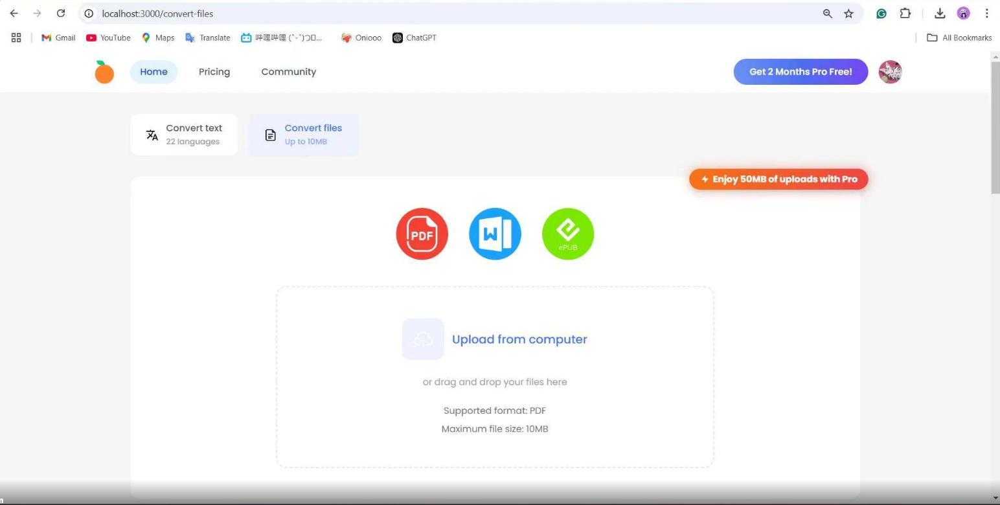

# Read Fast ⚡

> Transform your reading experience with bionic reading technology

Read Fast is a modern web application that helps users read faster and more efficiently by converting text into a bionic reading format. The app highlights key parts of words to guide the reader's eyes, making reading quicker and more focused.




## ✨ Features

- **📝 Text Conversion** - Convert any text into bionic reading format in real-time
- **📄 File Support** - Convert PDF, EPUB, DOCX, and TXT files (for subscribed users)
- **🌍 Multi-Language** - Support for 22 languages
- **🔐 Google Authentication** - Easy sign-in with Google account
- **💳 Subscription Plans** - Free, Pro, and Ultimate tiers with different features
- **🎨 Modern UI** - Clean and responsive design with Tailwind CSS
- **☁️ Cloud Storage** - Access your converted files from anywhere
- **👥 Community** - Share and discover content with other users

## 🚀 Tech Stack

### Frontend
- **React** with TypeScript
- **Vite** for fast development and building
- **Tailwind CSS** for styling
- **React Router** for navigation
- **Supabase** for authentication and storage

### Backend
- **FastAPI** (Python) for API endpoints
- **PyPDF2** & **PyMuPDF** for PDF processing
- **Stripe** for payment processing
- **Supabase** for database and authentication

## 📋 Prerequisites

- Node.js (v18 or higher)
- Python (v3.9 or higher)
- Supabase account
- Stripe account (for payments)

## 🛠️ Getting Started

### 1. Clone the repository

```bash
git clone <repository-url>
cd Read_Fast
```

### 2. Install Frontend Dependencies

```bash
npm install
```

### 3. Install Backend Dependencies

```bash
cd backend
pip install -r requirements.txt
```

### 4. Environment Setup

Create a `.env` file in the root directory:

```env
# Supabase Configuration
VITE_SUPABASE_URL=your_supabase_url
VITE_SUPABASE_ANON_KEY=your_supabase_anon_key

# Stripe Configuration
VITE_STRIPE_PUBLISHABLE_KEY=your_stripe_publishable_key

# App URL
VITE_APP_URL=http://localhost:3000
```

Create a `.env` file in the `backend` directory:

```env
# Supabase Configuration
SUPABASE_URL=your_supabase_url
SUPABASE_KEY=your_supabase_service_key

# Stripe Configuration
STRIPE_SECRET_KEY=your_stripe_secret_key
STRIPE_WEBHOOK_SECRET=your_stripe_webhook_secret

# CORS Origins
BACKEND_CORS_ORIGINS=http://localhost:3000
```

### 5. Database Setup

Run the database migrations in your Supabase project:

```bash
# Apply migrations from supabase/migrations/
```

### 6. Start Development Servers

**Frontend:**
```bash
npm run dev
```

**Backend:**
```bash
cd backend
python run.py
# or
python -m uvicorn app.main:app --reload
```

The application will be available at `http://localhost:3000`

## 📖 Usage

### Text Conversion

1. Navigate to the **Convert Text** page
2. Paste or type your text in the "Original text" area
3. View the converted bionic reading format in real-time in the "Fast Read" section
4. Use the full-screen toggle for distraction-free reading

### File Conversion

1. Sign in with your Google account
2. Navigate to the **Convert Files** page
3. Upload PDF files (drag and drop or click to browse)
4. Wait for processing to complete
5. Download your converted files

### Subscription Tiers

- **Free**: 5,000 characters, 10MB file uploads, 1 file at a time
- **Pro**: 50,000 characters, 50MB file uploads, 5 files at a time
- **Ultimate**: Unlimited characters, 100MB file uploads, 10 files at a time

## 🧪 Development

### Available Scripts

- `npm run dev` - Start development server
- `npm run build` - Build for production
- `npm run preview` - Preview production build
- `npm run lint` - Run ESLint

### Project Structure

```
Read_Fast/
├── src/                    # Frontend source code
│   ├── components/        # React components
│   ├── lib/               # Utility libraries
│   └── App.tsx            # Main app component
├── backend/               # Backend API
│   ├── app/
│   │   ├── api/          # API endpoints
│   │   ├── core/         # Core configuration
│   │   └── services/     # Business logic
│   └── requirements.txt  # Python dependencies
├── public/               # Static assets
└── supabase/            # Database migrations
```

## 🤝 Contributing

Contributions are welcome! Please feel free to submit a Pull Request.

## 📝 License

MIT License - feel free to use this project for your own purposes.

## 🙏 Acknowledgments

- Built with modern web technologies
- Powered by Supabase and Stripe
- Inspired by bionic reading research

---

Made with ❤️ for faster reading
